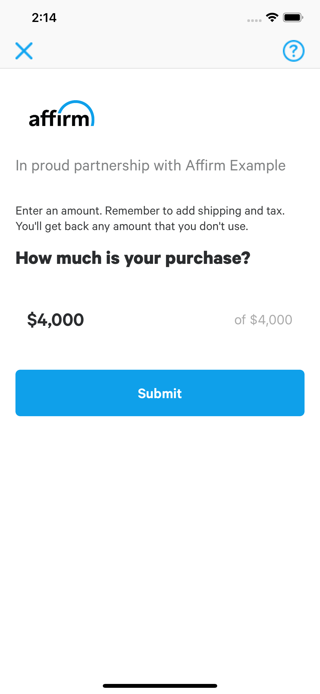
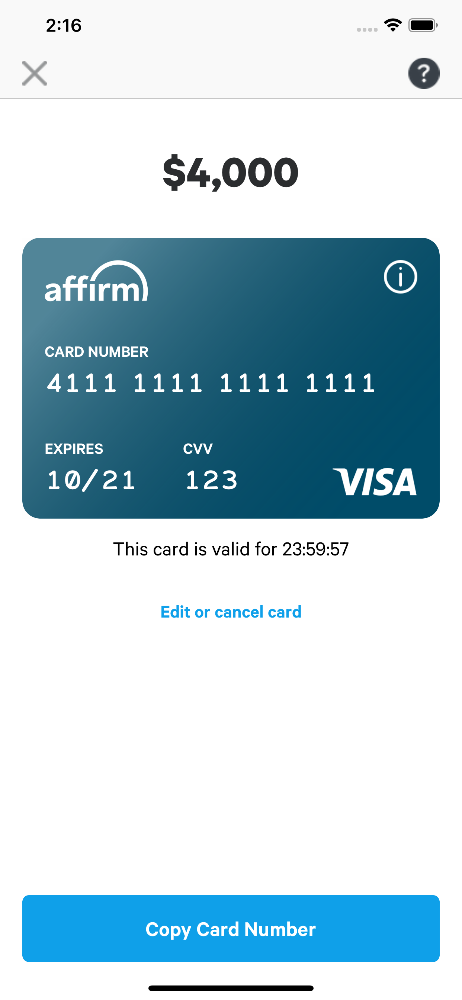

Affirm iOS SDK - New VCN Checkout Flow
==============

The Affirm iOS SDK also provides two screens to allow Affirm merchants to enter the total amount and display the card number.

Usage Overview
==============

- Present a screen to enter the total amount (a checkout object is required):
```
UINavigationController *nav = [AffirmEligibilityViewController startCheckoutWithNavigation:checkout
                                                                            getReasonCodes:YES
                                                                                  delegate:self];
[self presentViewController:nav animated:YES completion:nil];
```

<p align="center">

</p>

- Present a screen to show the credit card info (a checkout object and a credit card object are required):
```
UINavigationController *nav = [AffirmCardInfoViewController startCheckoutWithNavigation:checkout
                                                                            creditCard:creditCard
                                                                            getReasonCodes:YES
                                                                                  delegate:self];
[self presentViewController:nav animated:YES completion:nil];
```

<p align="center">

</p>
